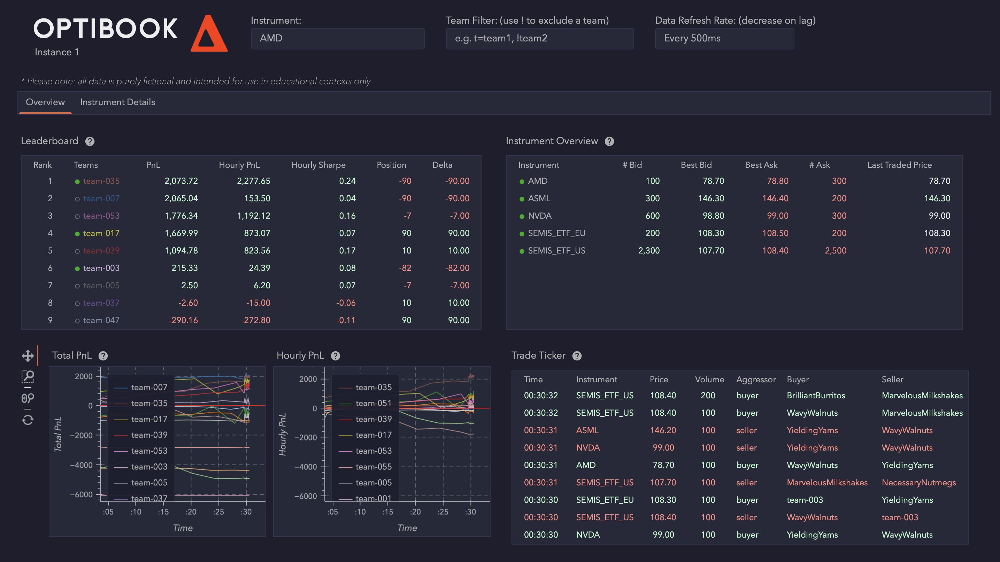

# SmartStonks 🚀📈 - HackaTUM 2024 Project

On **November 22-24, 2024**, our team participated in the **HackaTUM Hackathon** in Munich. Inspired by the complexities of modern algorithmic trading, we proudly present **SmartStonks**—a platform designed for dynamic, resilient, and profitable trading of semiconductor stocks and ETFs.

Our **Team 35** advanced to the **final round**, competing against the top teams at HackaTUM 2024!

**Note:** The code for SmartStonks is private to maintain fair competition for future challengers. If you'd like to learn more about how it works, don't hesitate to contact us!

---

## Project Challenge

### Problem

The rise of AI and the critical role of semiconductors in global markets have made trading semiconductor stocks and ETFs increasingly challenging. Key obstacles include:

- **Geographic Market Overlap**: Limited trading hours lead to inefficiencies between US and EU markets.
- **Volatility**: Divergence between ETF prices and underlying stocks creates short-term fluctuations.
- **Risk Management**: Balancing profit opportunities with exposure limits and effective hedging strategies.

Our mission: design an algorithm that could:

1. Identify profitable opportunities in real-time.
2. Effectively hedge trades to minimize risk.
3. Compete against other teams' algorithms in a fast-paced simulated environment.

### Challenges

- **Market Closures**: Estimating stock prices during closed-market periods required robust predictive techniques.
- **Risk Management**: Developing strategies that balanced aggressive trading with strict position limits.
- **Optimization**: Managing computational limits to comply with the 25 actions-per-second cap.
- **Dynamic Markets**: Responding to fast-changing conditions in a competitive environment was a steep learning curve.

### Vision

**SmartStonks** is designed to:

- **Optimize Trades**: Capitalize on pricing inefficiencies between ETFs and their underlying stocks.
- **Mitigate Risks**: Employ advanced hedging strategies for consistent and sustainable performance.
- **Enhance Market Liquidity**: Serve as a market maker by providing competitive quotes.
- **Adapt Dynamically**: Respond in real-time to changing market conditions.

---

## Project implementation

### How We Built It

- **Backend**: Developed in **Python** using the Optibook trading API for real-time order book interaction and data processing.
- **Algorithm Design**: Our trading strategy had three components:
  1. **ETF Arbitrage**: Exploiting price inefficiencies when both markets are open.
  2. **Basket Trading**: Utilizing a basket of stocks and ETFs, with price estimation during closed markets.
  3. **Market-Making**: Placing optimized limit orders to improve liquidity.
- **Visualization**: Utilized the Optibook visualizer for real-time monitoring of inventory, positions, and profits.
- **Infrastructure**: Deployed on **AWS EC2 instances** for high-performance computation and execution.

### How It Works

1. **Price Disparity Detection**: Monitors ETF and stock order books for mispriced opportunities.
2. **Hedging Strategy**: Executes simultaneous buy/sell orders across correlated instruments for risk-free profits.
3. **Market Making**: Places two-sided quotes to enhance liquidity while managing exposure.
4. **Dynamic Adaptation**: Adjusts strategies for overlapping and non-overlapping trading hours.

### Technologies

- **Python**: Core language for development and interaction with the Optibook API.
- **NumPy**: For real-time data analysis and mathematical computations.
- **Risk Management Module**: Ensures compliance with exposure limits and competition rules.

### Features

- **ETF Arbitrage**: Capitalizes on price gaps between SEMIS_ETF_US and SEMIS_ETF_EU.
- **Basket Hedging**: Trades semiconductor stocks (ASML, NVDA, AMD) against ETFs using theoretical price calculations.
- **Non-Overlapping Market Trading**: Continues trading during off-hours by estimating closed-market prices.
- **Limit Order Optimization**: Places and adjusts orders efficiently to maximize exposure within risk constraints.

---

### 🛠 Contributors

Developed with 🔥 by **Team 35**:
- Markus Huber
- Luca Bozzetti
- Sebastian Rogg

A heartfelt thanks to the HackaTUM organizers and participants for making this an unforgettable experience!
